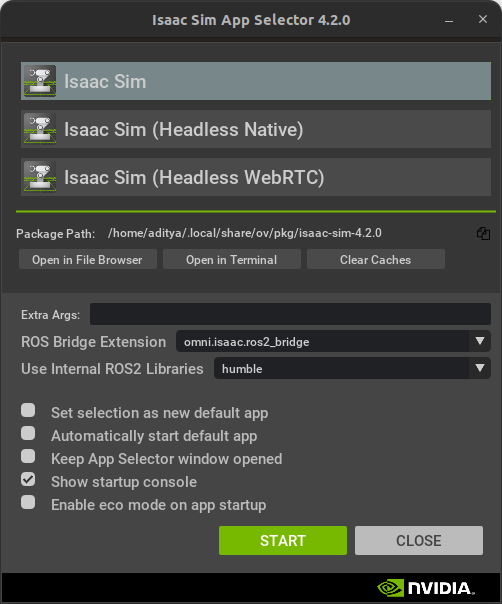
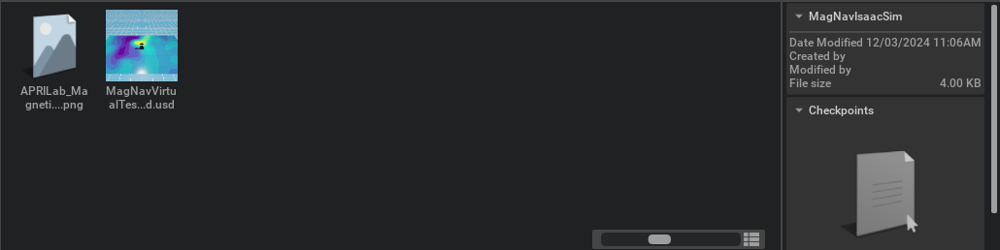
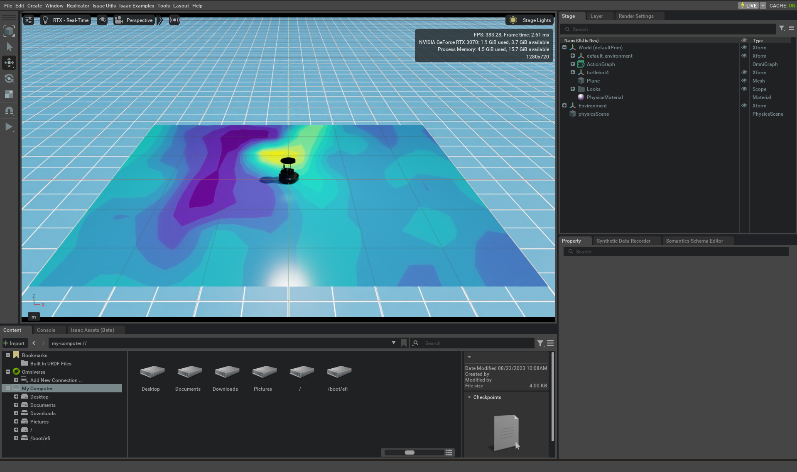

# MagNav Isaac Simulator

The MagNav Issac Simulator is intended to be a simulation environment that is a complement to the neural-based magnetometer given at this [Github Repo](https://github.com/aprilab-uf/nn_magnetometer.git). There are specific requirements to make this system work:

**Requirements**

* **All the requirements outlined by [NVIDIA's Isaac Sim](https://docs.omniverse.nvidia.com/isaacsim/latest/installation/requirements.html)**
* **OS**: Ubuntu 22.04 or higher, Windows can be used but has not been tested
* **ROS 2**: ROS 2 Humble or later

## Installing the MagNav Isaac Sim Environment

To install the Isaac Sim MagNav Sim, first download the zip file provided at the top of this page to create the environment. Extract these files to a folder you can easily locate: `/home/user/MagNavIsaacSim`

To run the robot sim environment, open NVIDIA's Omniverse launcher and run Isaac Sim with the ROS2 Bridge Extension

Then navigate to the folder you extracted the files to in either the content explorer, or from `File->Open`. You will see the two following assets in the extracted folder:

Open the file called `MagNavVirtualTestbed.usd` which contains the environment used. You will see the environment which looks as follows:

You should now be running a TurtleBot4 in Isaac Sim. To use the simulated magnetometer please visit the [NN Magnetometer Repo](https://github.com/aprilab-uf/nn_magnetometer.git).